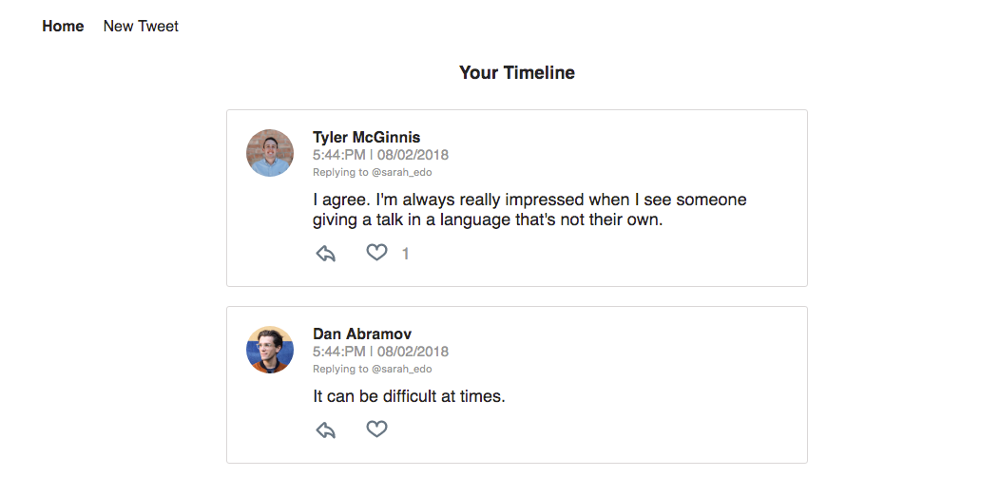
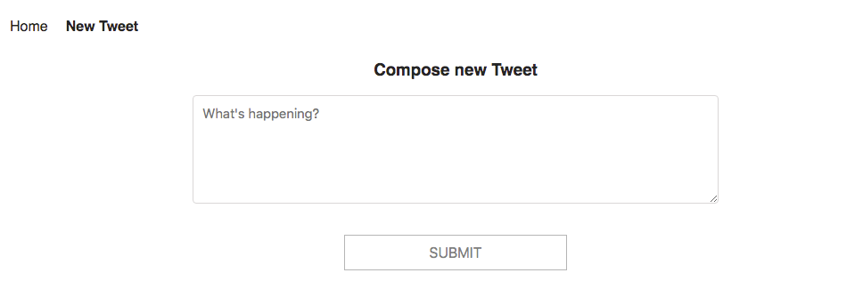
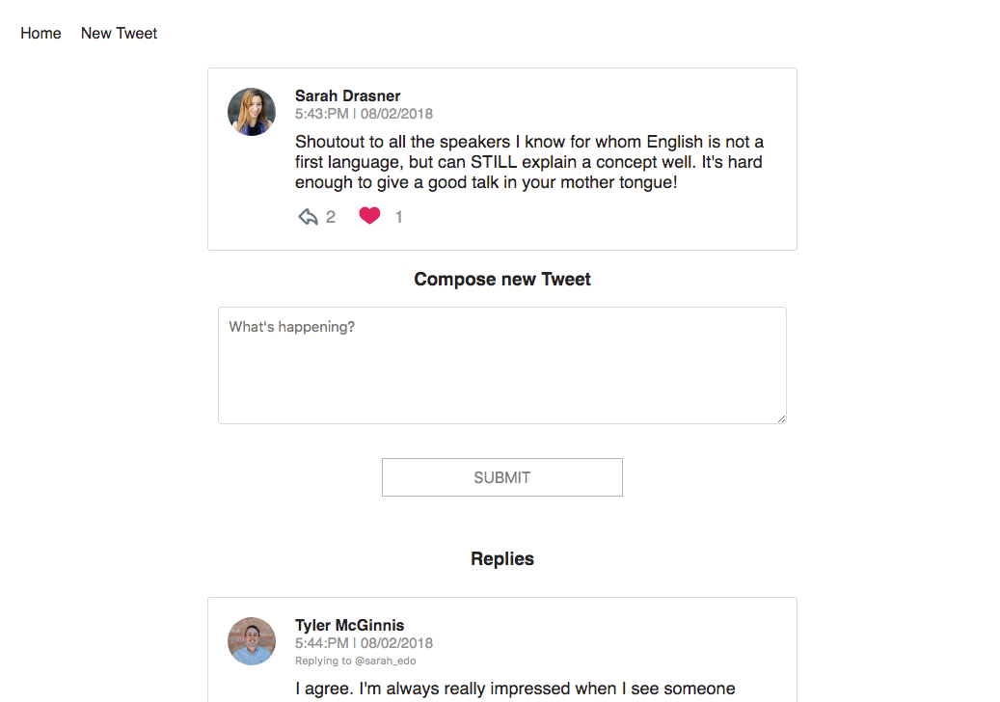

# :bird: Chirper Project

> This repository is reference the clone Twitter project, development with React and Redux.

## Screens


> List all tweets.


> Create new tweet.


> View, like and reply tweet.

## How to execute?
You must have Git and Node/npm installed on your localhost.

```
git clone https://github.com/juliafealves/chirper.git
cd chirper
npm i
npm start
```
